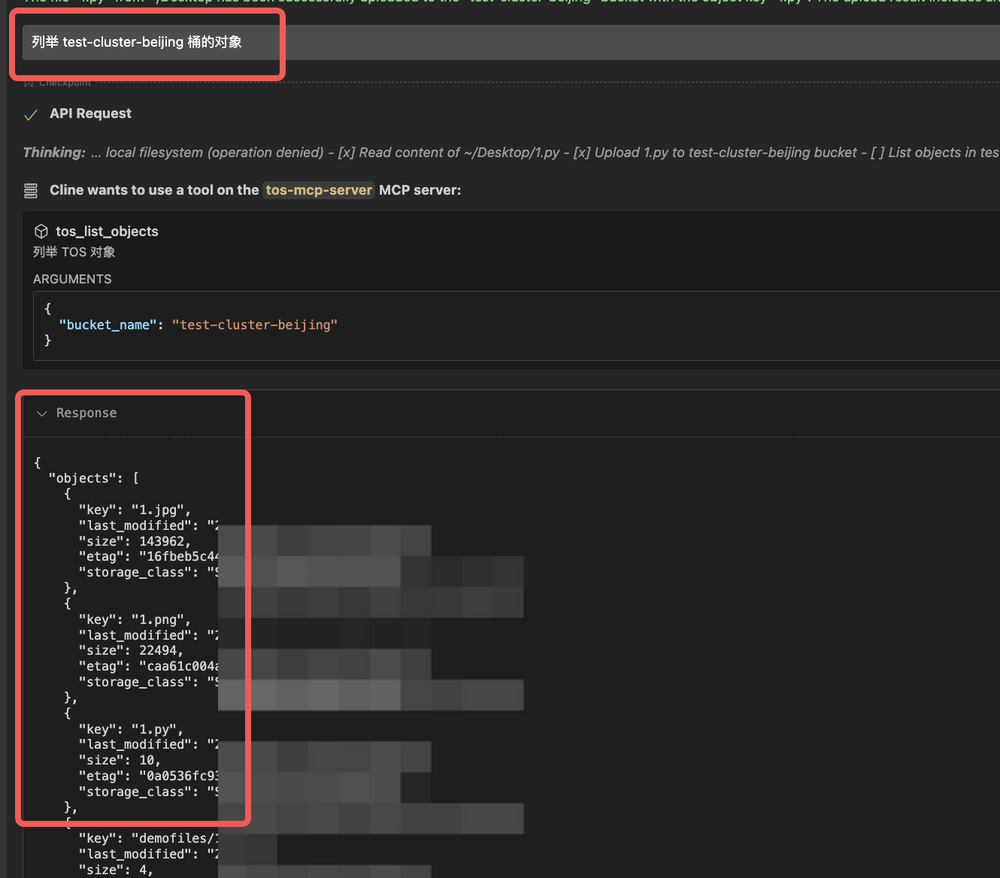
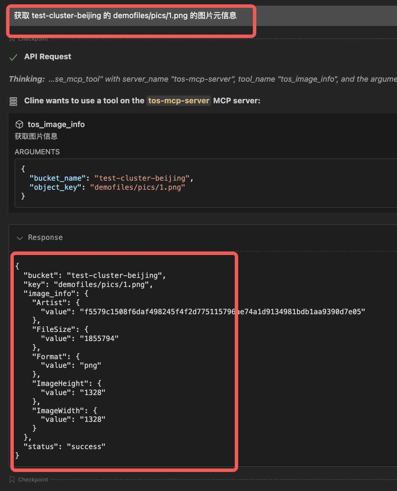

# 火山引擎 对象存储 TOS 非官方 MCP工具

* TOS 非官方 MCP 工具

## 快速开始

### 使用 uv (推荐，更好的可移植性)

#### 安装 uv
```bash
# Linux/macOS
curl -LsSf https://astral.sh/uv/install.sh | sh

```

#### 克隆项目和安装依赖
```bash
git clone <repository-url>
cd tos-mcp

# 自动安装依赖
uv sync
```

#### 运行服务器
```bash
# 直接运行（推荐）
uv run tos-mcp-server

# 或者通过模块运行
uv run python -m tos_mcp_server
```

### 环境变量配置

复制环境变量模板：
```bash
cp .env.example .env
```

编辑 `.env` 文件并填入配置，或者设置环境变量：
```bash
export TOS_ACCESS_KEY="your_access_key"
export TOS_SECRET_KEY="your_secret_key"
export TOS_REGION="cn-beijing"
export TOS_ENDPOINT="https://tos-cn-beijing.volces.com"
```


## config 配置

### 使用uv方式（推荐）

或者如果项目在用户目录下：

```json
{
  "mcpServers": {
    "tos-mcp-server": {
      "command": "uv",
      "args": ["run", "tos-mcp-server"],
      "cwd": "~/tos-mcp",
      "env": {
        "TOS_ACCESS_KEY": "your-access-key",
        "TOS_SECRET_KEY": "your-secret-key",
        "TOS_REGION": "cn-beijing", 
        "TOS_ENDPOINT": "https://tos-cn-beijing.volces.com"
      }
    }
  }
}
```

### 环境变量方式（.env文件）

如果你不想在配置中暴露敏感信息，可以使用.env文件：

1. 复制并配置环境变量：
```bash
cp .env.example .env
# 编辑.env文件填入你的配置
```

2. 简化的MCP配置：
```json
{
  "mcpServers": {
    "tos-mcp-server": {
      "command": "uv",
      "args": ["run", "tos-mcp-server"],
      "cwd": "~/tos-mcp"
    }
  }
}
```

## API 测试状态

| API 名称 | 功能描述 | 分类 | 测试状态 | 测试环境 | 备注 |
|---------|---------|------|---------|---------|------|
| `tos_create_bucket` | 创建存储桶 | 桶管理 | ✅ 已测试 | Cline | - |
| `tos_list_buckets` | 列举存储桶 | 桶管理 | ✅ 已测试 | Cline | - |
| `tos_get_bucket_meta` | 获取存储桶元数据 | 桶管理 | ✅ 已测试 | Cline | - |
| `tos_delete_bucket` | 删除存储桶 | 桶管理 | ✅ 已测试 | Cline | - |
| `tos_put_object` | 上传对象 | 对象管理 | ✅ 已测试 | Cline | - |
| `tos_get_object` | 下载对象 | 对象管理 | ✅ 已测试 | Cline | - |
| `tos_list_objects` | 列举对象 | 对象管理 | ✅ 已测试 | Cline | - |
| `tos_delete_object` | 删除对象 | 对象管理 | ✅ 已测试 | Cline | - |
| `tos_presigned_url` | 生成预签名URL | 预签名 | ✅ 已测试 | Cline | - |
| `tos_image_process` | 基础图片处理 | 图片处理 | ✅ 已测试 | Cline | 回写，并提供 URL 下载 |
| `tos_image_info` | 获取图片信息 | 图片处理 | ✅ 已测试 | Cline | - |
| `tos_video_snapshot` | 视频截帧 | 视频处理 | ✅ 已测试 | Cline | - |
| `tos_video_info` | 获取视频信息 | 视频处理 | ✅ 已测试 | Cline  | 回写，并提供 URL 下载 |


## 测试图片

### Cline 配置测试


### 创建bucket


### list bucket


### 删除 bucket


### 获取 bucket 元数据


### 生成预签名 url


### 下载TOS文件 到本地


### 上传本地文件 到TOS


### 列举桶内对象


### 删除文件


### 获取图片元信息


### 图像处理，并回写，生成 presign url


### 视频截帧，并回写，生成 presign url


## TOS 文档
* Python SDK 简介:https://www.volcengine.com/docs/6349/92785
* 安装 Python SDK:https://www.volcengine.com/docs/6349/93479
* 初始化客户端（Python SDK）:https://www.volcengine.com/docs/6349/93483
* 快速入门（Python SDK）:https://www.volcengine.com/docs/6349/92786
* 普通预签名（Python SDK）:https://www.volcengine.com/docs/6349/135725
* 创建桶(PythonSDK):https://www.volcengine.com/docs/6349/92793
* 列举桶(PythonSDK):https://www.volcengine.com/docs/6349/92794
* 获取桶元数据(PythonSDK):https://www.volcengine.com/docs/6349/92795
* 删除桶(PythonSDK):https://www.volcengine.com/docs/6349/92796
* 普通上传（Python SDK）:https://www.volcengine.com/docs/6349/92800
* 普通下载（Python SDK）:https://www.volcengine.com/docs/6349/92803
* 列举对象 V2（Python SDK）:https://www.volcengine.com/docs/6349/173820
* 删除对象（Python SDK）:https://www.volcengine.com/docs/6349/92805
* 基础图片处理（Python SDK）:https://www.volcengine.com/docs/6349/1157332
* 获取图片信息（Python SDK）:https://www.volcengine.com/docs/6349/1157336
* 图片处理持久化（Python SDK）:https://www.volcengine.com/docs/6349/1157338
* 视频截帧（Python SDK）:https://www.volcengine.com/docs/6349/1157340
* 获取视频信息（Python SDK）:https://www.volcengine.com/docs/6349/1157341
* 获取视频信息（Python SDK）:https://www.volcengine.com/docs/6349/1157343

## Appendix
* 本项目参考 https://github.com/dinghuazhou/sample-mcp-server-tos 